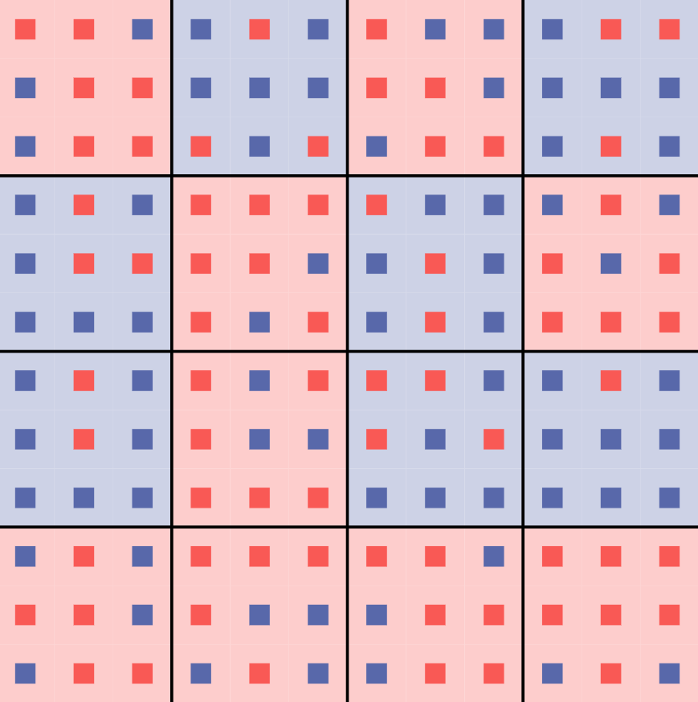
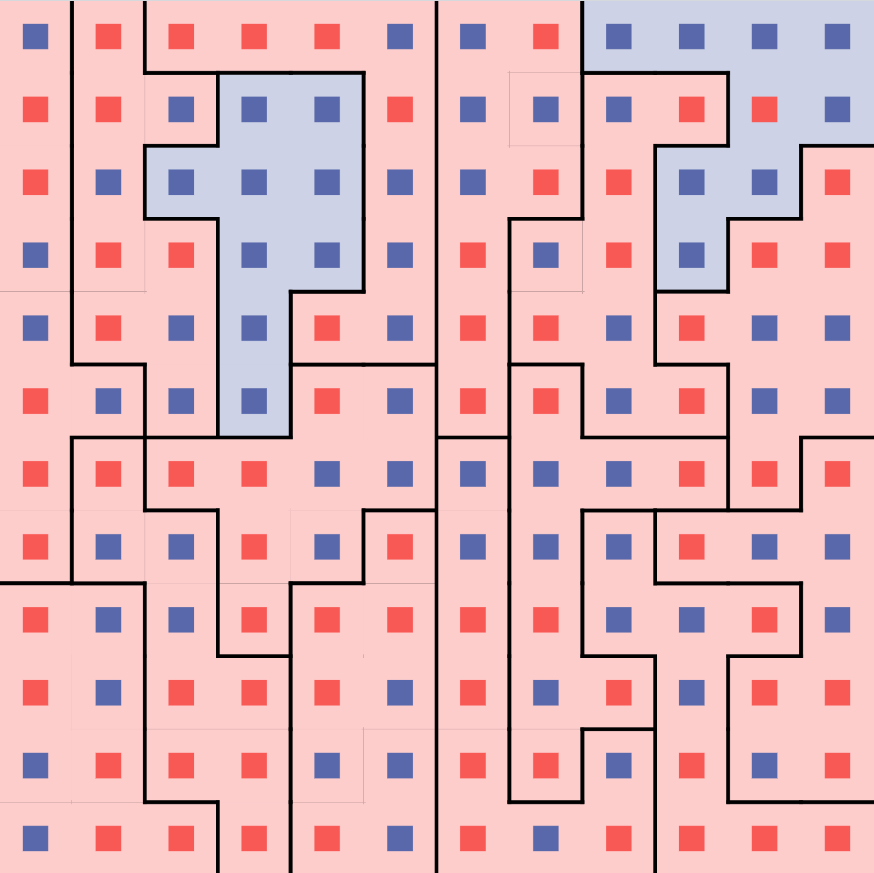

# Gerrymandering*
A program that draws district lines around a two-party grid of people (equal proportions for each party) in order to
give an unfair advantage to one party.

Try the browser version [here](https://mazore.github.io/gerrymandering-js) (repo [here](https://github.com/mazore/gerrymandering-js))

## Explanation

</img>

Above is a grid of people, each colored by which party they vote for. There are 72 blue people and 72 red people.

</img>

Districts are groups of people (9 people in this case) enclosed in black lines, shaded by winner (which party has more
people in the district).

</img>

We can draw the district lines in such a way that gives blue 14 districts and red only 2.

</img>

This is the **same people** but with lines drawn so that red has 14 districts and blue only has 2.

## Usage

You should use the browser version [here](https://github.com/mazore/gerrymandering-js)

For the desktop version, use this direct [download link](https://www.dropbox.com/s/n8uh1a8l9s8sxhx/gerrymandering.zip?dl=1),
extract the zip file, and run the `gerrymandering.exe` file.

To get the source code, just download the project off github and run `python main.py` in the directory to run the
program. Only python3 standard library is required.

## How It Works

### Overview

First, a grid of people is generated, with parties that are randomized while ensuring that there are an equal amount of
people in each party. Districts are then drawn around those people. Districts are initially squares of size
`district_size`, and we ensure that `grid_width` and `district_width` allow this to be possible. From there, we perform
a series of swaps of people between districts. These swaps will over time give one party (specified by `help_party`)
more and more districts, without changing the people grid.

### Swapping
We pick 2 districts, `district1` and `district2` that are touching by 2 or more people. We also pick a person from each
of those districts (`person1` and `person2`), using certain conditions to ensure that the swap not hinder the wrong
party or cause disconnections in the districts. More information about these conditions can be found in `get_person1`
and `get_person2` methods in `simulation/swap_manager.py`.


We can then make `person1` part of `district2`, and `person2` part of `district1`. 


In this example, we have flipped one district from being tied to being blue.

### Code structure


## Roadmap & Contributing
PR's, feedback, and general insight are much appreciated.

## Testing
Run `python tests.py`. This runs two simulations, one that figures out how much time is spent doing swaps (see
[Swapping](###swapping)) called avg_time, and another that takes the average score after a certain number of swaps
called avg_score. It also prints the parameters used to run each of these simulations, set in file `tests.py`. These
results can be compared with other versions, and the most recent results for the current version are at the bottom of
this file. Keep in mind that the avg_time varies greatly different machines.

## Test results for this version
```
avg_time:  71.3078 ms
avg_score:  29.09
score parameters: Parameters(help_party=blue, favor_tie=False, district_size=16, grid_width=24, canvas_width=640, line_width=3, show_margins=False, sleep_between_draws=0, num_swaps_per_draw=2000, num_swaps=1000, simulation_time=None, hinder_party=red, num_simulations=10, start_running=True, num_districts=36.0) x 50 processes
time parameters: Parameters(help_party=blue, favor_tie=False, district_size=16, grid_width=24, canvas_width=640, line_width=3, show_margins=False, sleep_between_draws=0, num_swaps_per_draw=2000, num_swaps=1000, simulation_time=None, hinder_party=red, num_simulations=150, start_running=True, num_districts=36.0)
```
